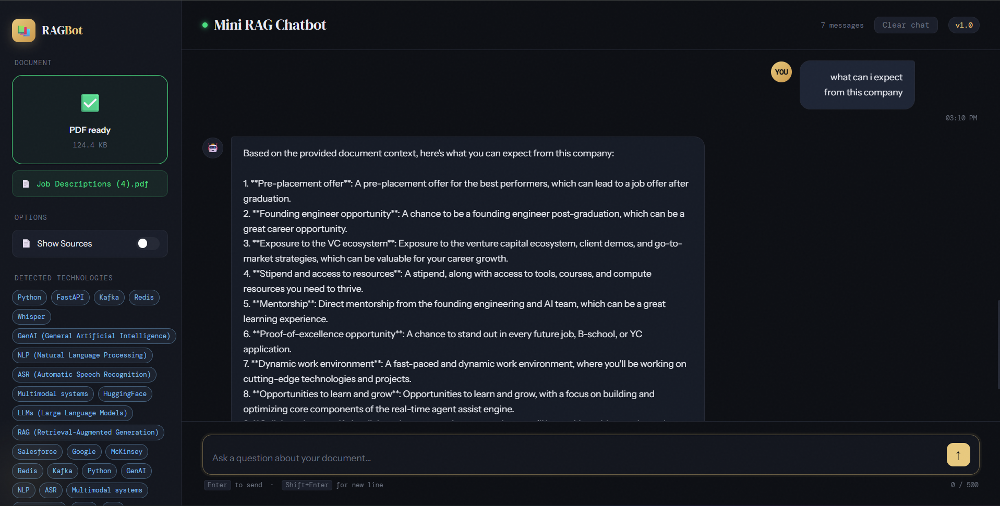

# 🤖 Mini RAG Chatbot

A full-stack **Retrieval-Augmented Generation (RAG)** chatbot that lets you upload any PDF and have an intelligent, multi-turn conversation with its contents.

Built with FastAPI, LangChain, FAISS, HuggingFace Embeddings, and Groq (Llama 3.1).



---

## ✨ Features

- 📄 **PDF Upload & Indexing** — Upload any PDF; it gets chunked and embedded automatically
- 🔍 **Semantic Search** — FAISS vector store retrieves the most relevant chunks per query
- 🧠 **Multi-turn Conversation** — Remembers context across follow-up questions
- 💾 **Persistent Chat History** — Conversations survive page refresh via localStorage
- 🛠️ **Tech Stack Detection** — Automatically detects technologies mentioned in the document
- 📌 **Show Sources** — Toggle to see which document chunks were used to answer
- 🌑 **Clean Dark UI** — Responsive chat interface built in vanilla HTML/JS

---

## 🏗️ Architecture

```
User → HTML Frontend
         ↓ HTTP (fetch)
      FastAPI Backend
         ↓
      PDF Loader (PyPDF)
         ↓
      Text Splitter (RecursiveCharacterTextSplitter)
         ↓
      HuggingFace Embeddings (all-mpnet-base-v2)
         ↓
      FAISS Vector Store
         ↓ top-k retrieval
      Groq LLM (Llama 3.1 8B Instant)
         ↓
      Answer + Sources → Frontend
```

---

## 🧰 Tech Stack

| Layer | Technology |
|---|---|
| Backend | FastAPI, Python |
| LLM | Groq API (Llama 3.1 8B Instant) |
| Embeddings | HuggingFace `all-mpnet-base-v2` |
| Vector Store | FAISS (CPU) |
| Document Loader | LangChain + PyPDF |
| Frontend | Vanilla HTML, CSS, JavaScript |
| Env Management | python-dotenv |

---

## 🚀 Getting Started

### 1. Clone the repo
```bash
git clone https://github.com/YOUR_USERNAME/mini-rag-chatbot.git
cd mini-rag-chatbot
```

### 2. Install dependencies
```bash
pip install -r requirements.txt
```

### 3. Set up environment variables
Create a `.env` file in the root directory:
```
GROQ_API_KEY=your_groq_api_key_here
```
Get a free API key at [console.groq.com](https://console.groq.com)

### 4. Run the backend
```bash
uvicorn app:app --reload --port 8000
```

### 5. Open the frontend
Open `rag_chatbot_ui.html` directly in your browser (or serve it via Live Server in VS Code).

---

## 📁 Project Structure

```
mini-rag-chatbot/
├── app.py                  # FastAPI backend — upload, embed, retrieve, answer
├── rag_chatbot_ui.html     # Frontend — chat UI with localStorage persistence
├── requirements.txt        # Python dependencies
├── .env                    # API keys (not committed)
├── data/
│   └── sample.pdf          # Sample PDF for testing
└── README.md
```

---

## 🔌 API Endpoints

| Method | Endpoint | Description |
|---|---|---|
| GET | `/` | Health check |
| GET | `/health` | Model load status |
| POST | `/upload` | Upload and index a PDF |
| POST | `/ask` | Ask a question with chat history |

### Example `/ask` request
```json
{
  "query": "What is the job role?",
  "history": [
    { "role": "user", "content": "Who is the company?" },
    { "role": "assistant", "content": "The company is Darwix AI." }
  ],
  "show_source": false
}
```

---

## 💡 How It Works

1. **Upload** — PDF is saved, loaded with PyPDF, split into 500-token chunks with 100-token overlap
2. **Embed** — Each chunk is embedded using `sentence-transformers/all-mpnet-base-v2`
3. **Store** — Embeddings are stored in a FAISS index in memory
4. **Query** — User question is embedded, top-6 similar chunks are retrieved
5. **Answer** — Retrieved chunks + last 6 messages of chat history are sent to Groq Llama 3.1
6. **Persist** — Chat history is saved to browser localStorage and restored on refresh

---

## 🛣️ Future Improvements

- [ ] Multi-PDF support (query across multiple documents)
- [ ] Persistent vector store (save/load FAISS index to disk)
- [ ] User authentication and per-user chat sessions
- [ ] Deployment on Railway / Render

---

## 👤 Author

**Your Name**
- GitHub: [@YOUR_USERNAME](https://github.com/YOUR_USERNAME)
- LinkedIn: [linkedin.com/in/YOUR_PROFILE](https://linkedin.com/in/YOUR_PROFILE)

---

## 📄 License

MIT License — feel free to use and modify.
